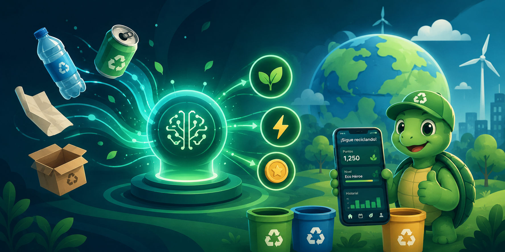

# ♻ Reciclaje App 📱🖥️

<div align="center">
  
  </div>

Sistema de gestión de reciclaje con turnero inteligente, **offline-first** y de red local:

| Componente | Tecnología | Entregable |
| --- | --- | --- |
| 🖥️ Escritorio (servidor + panel admin) | Electron + Express + WebSocket + SQLite | Instalador **MSI** |
| 📱 App móvil multirol (cliente / pesaje / admin / kiosko) | Android (Kotlin) | **`ReciclajeTurnero-*.apk`** |
| 📺 App dedicada para TV (solo turnero, auto-arranque) | Android (Kotlin) | **`ReciclajeKiosko-*.apk`** |

Los instaladores se publican automáticamente en la sección **[Releases](../../releases)** de este repositorio.

## Arquitectura

```
[APP ANDROID] ←— WiFi local (autodescubrimiento UDP) —→ [SERVIDOR LOCAL (DESKTOP)]
                                                              │  API REST + WebSocket + SQLite
                                                              ▼
                                                  [PANTALLAS / TV EN MODO KIOSKO]
```

- **Offline-first**: todo funciona en red local, sin internet. La app encola la solicitud
  y reintenta automáticamente si pierde conexión.
- **Autodescubrimiento**: la app encuentra el servidor sola por broadcast UDP (puerto 18300);
  no hay que escribir la IP.
- **Recibos firmados** con HMAC-SHA256 y descargables en JSON desde el panel.

## Roles de la app Android

Al abrir la app, cada dispositivo elige cómo se va a usar:

| Rol | Emparejamiento | Qué hace |
| --- | --- | --- |
| 👤 **Cliente** | Sin PIN (se identifica con su documento) | Solicita turno (QR + PIN), vibra al ser llamado, ve su recibo, recibe la notificación de **pago** y consulta su historial (pendientes y pagados) |
| ⚖️ **Pesaje** | PIN de sesión → token | Llama turnos al módulo, registra kilos con valor calculado en vivo y finaliza generando el recibo |
| 💵 **Administrador** | PIN de sesión → token | Ve los recibos por pagar y **autoriza el desembolso** del efectivo |
| 📦 **Inventario** | PIN de sesión → token | Ve el stock de material embalado, registra entradas y embala material suelto en bultos/bloques/pacas |
| 📺 **Modo Kiosko** | PIN de sesión → token (una sola vez) | Convierte un TV Android en la pantalla del turnero, a pantalla completa y con reconexión automática |

### App dedicada para TV (`Reciclaje TV`)

Para los televisores de la bodega, instala el APK **`ReciclajeKiosko-*.apk`** (app aparte,
con su propio ícono). Se vincula **una sola vez** con el PIN de sesión de kiosko y a partir
de ahí:

- **Arranca automáticamente** cuando se enciende o reinicia el televisor.
- **No vuelve a pedir el PIN** al apagar/encender: queda vinculada de forma permanente.
- Si el administrador **revoca** el TV desde el panel, se genera un **PIN nuevo solo para el
  rol kiosko** y el televisor vuelve a pedir la vinculación con ese PIN.

## Seguridad

- Los roles elevados se emparejan con **PINs de sesión aleatorios de 6 dígitos** que el
  escritorio genera en cada arranque (visibles en el panel). El PIN se ingresa **una sola
  vez por dispositivo**: el emparejamiento entrega un token persistente.
- **Múltiples dispositivos** por rol, con lista en *Configuración → Dispositivos emparejados*
  (último acceso visible) y **revocación inmediata** desde el panel.
- Las rutas administrativas del panel solo aceptan conexiones desde el propio equipo servidor.
- El documento del cliente se enmascara en las vistas públicas del turnero.

## Flujo del sistema

1. **Registro**: el cliente solicita turno (documento + material opcional) → número, QR y PIN.
2. **Visualización**: pantallas/TV muestran la fila y los llamados con su módulo, más la
   marquesina con precios y mensajes.
3. **Llamado**: desde el panel o la app de pesaje → el teléfono del cliente vibra.
4. **Pesaje**: se registran materiales y kilos (valor calculado con los precios configurados);
   al finalizar se genera el recibo firmado.
5. **Pago**: el administrador autoriza el desembolso → el cliente recibe "💵 ¡Pago recibido!"
   y su turno se limpia. **Un turno sin pagar sigue abierto**: el mismo documento lo retoma,
   no puede duplicar turno.
6. **Ausencias**: timeout configurable → NO_PRESENTADO automático.

## Panel de administración (escritorio)

- Turnos con **filtros** (documento/número, estado — incluye *Por pagar* —, fecha) y columnas
  de hora de **registro** y **atención**.
- Estado de pago visible: `POR PAGAR 💵` / `PAGADO ✓`, recibo en tabla legible con
  botón **Descargar JSON** y autorización de desembolso.
- **Materiales**: editar nombres y precios, agregar personalizados y eliminar
  (13 materiales precargados con precios referenciales COP/kg de Mayo 2025).
- **Inventario**: stock de material embalado (se alimenta solo con cada pesaje como
  *Suelto*), entradas/ajustes del inventario previo y **embalaje** en bultos/bloques/pacas.
  **Salidas** hacia el mayorista que **descuentan el inventario** y generan un **manifiesto
  de carga** imprimible (PDF) y descargable (JSON), con fecha, despacha/recibe/conductor y
  la sección *Información de la carga* (código UN, designación de mercancía, etc.).
- **Marquesina**: velocidad de desplazamiento y mensaje personalizado (teléfonos, avisos)
  que rota tras la lista completa de precios.

## API REST local (resumen)

| Método | Ruta | Acceso | Descripción |
| --- | --- | --- | --- |
| GET | `/api/ping` | Público | Info del servidor; con token devuelve el rol del dispositivo |
| POST | `/api/emparejar` | PIN de sesión | Empareja un dispositivo (pesaje/admin/kiosko) → token |
| POST | `/api/turnos` | Público | Crear turno (retoma el abierto/pendiente de pago del mismo documento) |
| GET | `/api/turnos` | Público* | Turnos del día (`?fecha=` histórico; documento enmascarado) |
| GET | `/api/turnos/:id` | Público | Estado de un turno |
| PUT | `/api/turnos/:id/estado` | Token pesaje | Llamar / cambiar estado / asignar módulo |
| POST | `/api/pesaje` | Token pesaje | Registrar pesaje |
| POST | `/api/turnos/:id/finalizar` | Token pesaje | Generar recibo firmado |
| GET | `/api/recibos` | Token admin | Recibos (`?pendientes=1`) |
| POST | `/api/recibos/:id/pagar` | Token admin | Autorizar desembolso |
| GET | `/api/historial` | Público | Recibos del documento indicado (pendientes y pagados) |
| GET/POST/PUT/DELETE | `/api/materiales` | GET público / resto token admin | Materiales y precios |
| GET | `/api/display` | Público | Config de marquesina (velocidad, mensaje) |
| GET/PUT | `/api/config`, `/api/dispositivos` | Solo servidor | Configuración y revocación de accesos |

\* Los operadores con token ven el documento completo. WebSocket en `/ws` para tiempo real.

## Desarrollo

```bash
# Escritorio
cd desktop
npm install
npm start                    # desarrollo
npm run dist                 # generar el MSI
node ../.ci/smoke-test.js    # smoke test de la API (13 verificaciones)

# Android
cd android
./gradlew assembleRelease    # APK firmado (app/build/outputs/apk/release/)
```

> ⚠️ El keystore incluido (`android/keystore/`) es de desarrollo, para que CI y builds
> locales firmen igual. Para producción genera uno propio y muévelo a GitHub Secrets.

## Releases automáticas

Cada push de un tag `v*` compila el MSI (Windows) y el APK (Linux) en GitHub Actions y los
adjunta a una Release con notas generadas automáticamente:

```bash
git tag v0.5.0
git push origin main v0.5.0
```

¿El tag no subió? Ejecuta el workflow **Release** manualmente desde la pestaña *Actions*
indicando el tag. El historial de cambios está en [CHANGELOG.md](CHANGELOG.md).

## Licencia

[MIT](LICENSE)

## Apoyo / Donaciones

Si este proyecto te resulta útil, puedes apoyar su desarrollo:

[](https://ko-fi.com/V7V81LV7GX)

Repositorio: <https://github.com/jhonsu01/ReciclajeApp>
